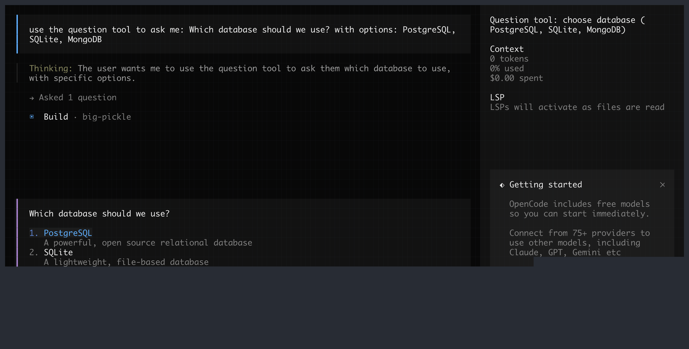
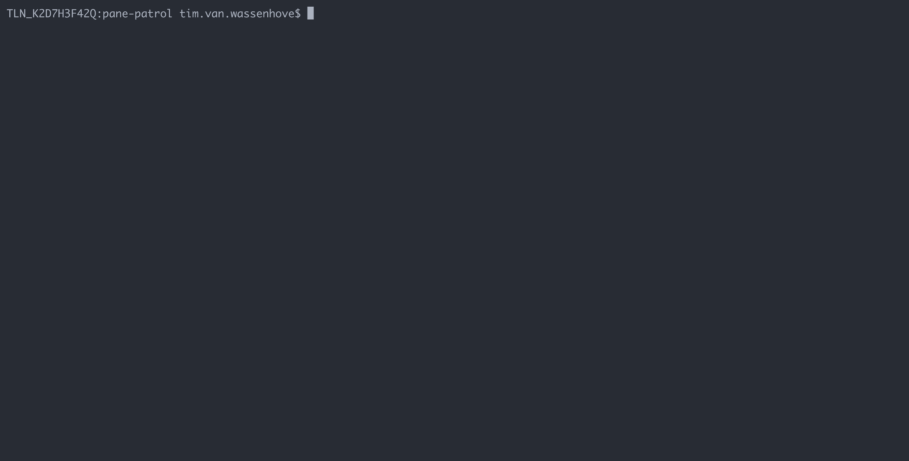

# pane-patrol

Terminal pane monitor for AI coding agents — detects blocked states and suggests unblocking actions.

## What it does

pane-patrol monitors terminal multiplexer panes (tmux) and determines if AI
coding agents are blocked waiting for human input — confirmation dialogs,
permission prompts, questions, or idle at their input prompt.

It uses **deterministic parsers** for known agents (OpenCode, Claude Code,
Codex) — instant, free, no API key needed. Unknown panes are classified as
"not_an_agent".


## How it works

When running multiple AI coding agents across tmux panes, they frequently
get **blocked waiting for human input** — confirmation dialogs, permission
prompts, questions, or just finishing a task and sitting idle at their
input prompt. With several agents running in parallel, you're constantly
cycling through tmux windows checking if anything is stuck.

The supervisor solves this with a continuous scan loop (every 5s by default):

1. **List** all tmux panes
2. **Filter** — skip excluded sessions, skip the supervisor's own pane
3. **For each pane:**
   - **Capture** visible terminal content via `tmux capture-pane`
   - **Collect process metadata** — shell PID and child process tree
     (via `pgrep -P` and `ps`), prepended as a `[Process Info]` header
   - **Check cache** — SHA256 hash of content; if unchanged since last
     scan and within TTL (2m default), reuse the previous verdict
   - **Deterministic parser** — known agents (OpenCode, Claude Code,
      Codex) are identified by process tree and TUI markers, then evaluated
      by exact pattern matching derived from each agent's source code;
      unrecognized panes are classified as "not_an_agent"
4. **Display** results in the interactive TUI
5. **Wait** for next refresh tick or user action

### Deterministic parsers

Deterministic parsers (`internal/parser/`) handle known agents by matching
exact TUI patterns derived from each agent's source code. This is protocol
parsing, not heuristic classification. Parsers produce verdicts with specific
unblocking actions (e.g., numeric key `1` for Claude Code permission dialogs,
`Enter` for Codex approvals). Unknown panes are classified as "not_an_agent".

### Why the cache works

The cache is content-hash based — it only hits when the pane content is
byte-for-byte identical to the previous scan. This naturally handles the
active vs. blocked distinction:

- **Active agents** have animated spinners (braille characters cycling at
  80ms, Knight Rider blocks at 40ms) that change the captured content
  between scans → cache miss → fresh evaluation
- **Blocked agents** show a static prompt that doesn't change → cache
  hit → reuse previous verdict
- **Non-agent panes** (idle shells, logs) are also static → cache hit

This means frequent scanning is cheap: blocked panes (the ones you
actually care about detecting) are cached, while active panes get fresh
evaluations that quickly confirm "not blocked."

## Installation

### Homebrew (macOS / Linux)

```bash
brew install timvw/tap/pane-patrol
```

### Debian / Ubuntu

```bash
# amd64
curl -LO https://github.com/timvw/pane-patrol/releases/latest/download/pane-patrol_0.2.0_linux_amd64.deb
sudo dpkg -i pane-patrol_0.2.0_linux_amd64.deb

# arm64
curl -LO https://github.com/timvw/pane-patrol/releases/latest/download/pane-patrol_0.2.0_linux_arm64.deb
sudo dpkg -i pane-patrol_0.2.0_linux_arm64.deb
```

### RPM (Fedora / RHEL)

```bash
sudo rpm -i https://github.com/timvw/pane-patrol/releases/latest/download/pane-patrol_0.2.0_linux_amd64.rpm
```

### Arch Linux

```bash
curl -LO https://github.com/timvw/pane-patrol/releases/latest/download/pane-patrol_0.2.0_linux_amd64.pkg.tar.zst
sudo pacman -U pane-patrol_0.2.0_linux_amd64.pkg.tar.zst
```

### Binary (any Linux / macOS)

```bash
# Download the tarball for your platform (linux_amd64, linux_arm64, darwin_amd64, darwin_arm64)
curl -LO https://github.com/timvw/pane-patrol/releases/latest/download/pane-patrol_0.2.0_linux_amd64.tar.gz
tar xzf pane-patrol_0.2.0_linux_amd64.tar.gz
sudo mv pane-patrol /usr/local/bin/
```

### Go install

```bash
go install github.com/timvw/pane-patrol@latest
```

### From source

```bash
git clone https://github.com/timvw/pane-patrol.git
cd pane-patrol
go build -o bin/pane-patrol .
```

## Supervisor TUI

The primary way to use pane-patrol. Launch an interactive terminal UI that
continuously scans all panes, shows agent status, and lets you unblock stuck
agents with suggested actions or free-form text.

```bash
pane-patrol supervisor
```

If you run the supervisor **outside tmux** (e.g., from a standalone terminal),
it automatically re-launches itself inside a new tmux session so that
navigation (click, Enter, post-action jump via `tmux switch-client`) works
correctly. Scanning and nudging work either way — only navigation requires an
active tmux client.

Use `--no-embed` to disable auto-embedding:

```bash
pane-patrol supervisor --no-embed
```

### Keyboard shortcuts

| Key | Action |
|-----|--------|
| `Enter` / click | Jump to pane in tmux |
| `->` / `Tab` | Focus action panel |
| `<-` / `Esc` | Back to pane list |
| `1`-`9` | Execute Nth action directly |
| `t` | Type free-form text to send to pane |
| `f` | Cycle display filter: blocked / agents / all |
| `a` | Toggle auto-nudge |
| `r` | Force rescan |
| `q` | Quit |

### Hook-first mode (experimental)

You can run the supervisor in hook-first mode so assistant hooks become the
source of truth for blocked/waiting state.

```bash
pane-patrol supervisor --hook-first
```

Optional: override event socket path:

```bash
pane-patrol supervisor --hook-first --event-socket /tmp/pane-patrol-1000/events.sock
```

In hook-first mode, the dashboard only shows attention states emitted by hooks
(`waiting_input`, `waiting_approval`) and still uses `tmux switch-client` to
jump to the pane target from events.

### Install assistant hooks

Install built-in hook adapters for Claude, OpenCode, and Codex:

```bash
just install-hooks
```

This copies scripts to:

- `~/.claude/hooks/pane-patrol-emit.sh`
- `~/.config/opencode/hooks/pane-patrol-emit.sh`
- `~/.config/codex/hooks/pane-patrol-emit.sh`

### Hook security model

Hook events use a local Unix datagram socket and same-UID trust model.

- Socket dir permissions: `0700`
- Socket permissions: `0600`
- No TCP listener

Any process under the same user can emit events in v1 (documented trade-off).

### Fire-and-forget behavior

Hook adapters are designed to never block assistant UX.

- One best-effort datagram send
- No retries
- Exit success when listener is unavailable

### Display filter

Press `f` to cycle through three views:

- **blocked** (default) — only agent panes that are stuck waiting for input
- **agents** — all agent panes (blocked + active), hides non-agents
- **all** — everything including non-agent panes

The summary line shows `visible/total panes` so you can see how much is filtered.

| blocked | agents | all |
|---------|--------|-----|
|  |  |  |

### Jump to pane

Press `Enter` on any pane to jump directly to it in tmux. The supervisor exits
and `tmux switch-client` navigates you to the blocked agent, showing its actual
TUI — permission dialogs, question prompts, or whatever is waiting for input.

| select a pane | jump to the agent TUI |
|---------------|----------------------|
|  |  |

### Auto-nudge

Press `a` to toggle automatic nudging. When enabled, the supervisor
automatically sends the recommended action to blocked panes if the
action's risk level is within the configured threshold (default: `low`).

### Two-panel layout

- **Left panel**: session/pane list grouped by tmux session, with status icons
  (`⚠` blocked, `✓` active, `·` non-agent)
- **Right panel**: details and suggested actions for the selected pane,
  with risk levels (`low`, `med`, `HIGH`)

## Configuration

pane-patrol loads configuration with this precedence (highest to lowest):

1. CLI flags
2. Environment variables (`PANE_PATROL_*`)
3. Config file
4. Built-in defaults

### Config file

pane-patrol searches for a config file in this order:

1. `.pane-patrol.yaml` in the current directory
2. `~/.config/pane-patrol/config.yaml`

Example `.pane-patrol.yaml`:

```yaml
# Sessions to exclude from scanning entirely.
# Supports exact match and prefix globs with trailing * (e.g. "AIGGTM-*").
exclude_sessions:
  - langfuse
  - tmux-resume
  - "AIGGTM-*"    # prefix glob: matches AIGGTM-1234, AIGGTM-foo, etc.

# Auto-refresh interval (set to "0" or "off" to disable)
refresh: 5s

# Verdict cache TTL — reuse results when pane content hasn't changed.
# Set to "0" or "off" to disable caching. Default: 2m.
cache_ttl: 2m

# Auto-nudge settings
auto_nudge: false
auto_nudge_max_risk: low  # low, medium, or high

# OTEL/Langfuse observability
otel_endpoint: http://localhost:3000/api/public/otel
otel_headers: "Authorization=Basic <base64-encoded-credentials>"
```

### Environment variables

| Variable | Description |
|----------|-------------|
| `PANE_PATROL_FILTER` | Regex filter on session names (include) |
| `PANE_PATROL_EXCLUDE_SESSIONS` | Comma-separated session names/globs to exclude (e.g. `AIGGTM-*,private`) |
| `PANE_PATROL_REFRESH` | Auto-refresh interval (e.g. `30s`, `0` to disable) |
| `PANE_PATROL_CACHE_TTL` | Verdict cache TTL (e.g. `5m`, `0` to disable) |
| `PANE_PATROL_AUTO_NUDGE` | Enable auto-nudge (`true` or `1`) |
| `PANE_PATROL_AUTO_NUDGE_MAX_RISK` | Max risk for auto-nudge: `low`, `medium`, `high` |
| `OTEL_EXPORTER_OTLP_ENDPOINT` | OTEL exporter endpoint |
| `OTEL_EXPORTER_OTLP_HEADERS` | OTEL exporter headers |

## CLI commands

### List all panes

```bash
pane-patrol list
pane-patrol list --filter "^wt-"
```

### Capture pane content

```bash
pane-patrol capture mysession:0.0
```

### Check a single pane

```bash
pane-patrol check mysession:0.0
```

Output includes agent classification, blocked status, reason, and suggested
actions with risk levels.

### Scan all panes



```bash
# Scan all panes (parallel by default, max 10 concurrent)
pane-patrol scan

# Scan with filter and custom parallelism
pane-patrol scan --filter "^wt-" --parallel 4

# Include raw pane content in output
pane-patrol scan --verbose

# Pipe through jq to find blocked agents
pane-patrol scan | jq '[.[] | select(.blocked == true)]'
```

## Observability

pane-patrol supports OTEL tracing with Langfuse integration. Configure
`otel_endpoint` and `otel_headers` in the config file or via environment
variables. Each scan creates a trace with per-pane spans including:

- Pane target, session, and command
- Process tree (shell PID + child processes)
- Verdict (agent type, blocked status, reason)
- Cache hit/miss status

## Design

See [docs/design-principles.md](docs/design-principles.md) for the full design
philosophy, including ZFC compliance, composability, and feedback loop design.

## Testing

See [docs/testing.md](docs/testing.md) for local checks, hook install checks,
isolated integration tests, and manual hook-first verification.

## Isolated integration testing

Run hook-first integration tests in a containerized harness (private HOME,
private runtime dir, private tmux server):

```bash
bash test/integration/run.sh
```

## License

MIT
