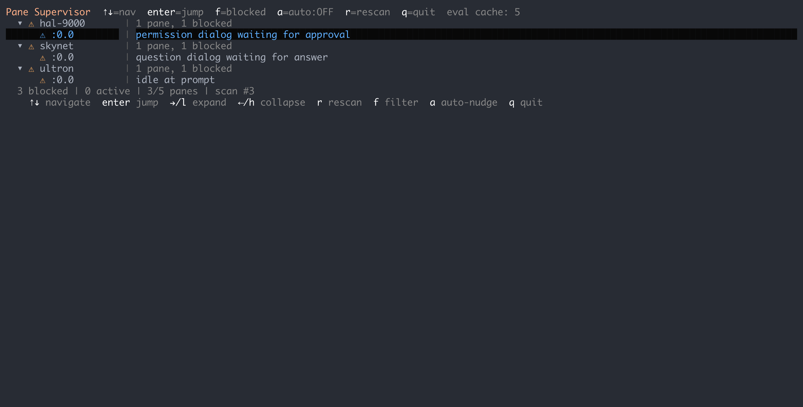
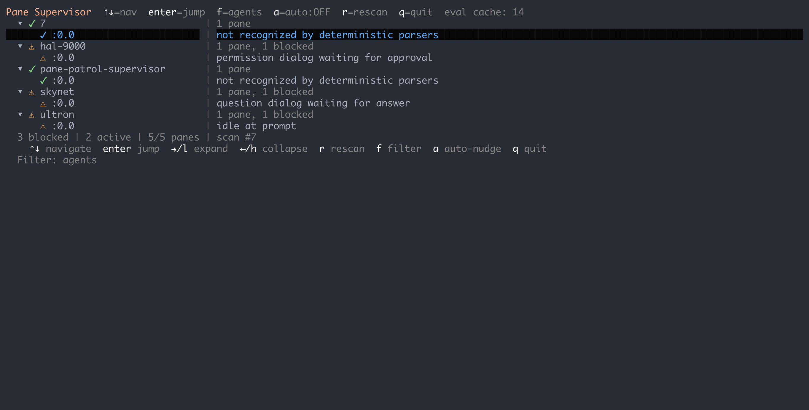
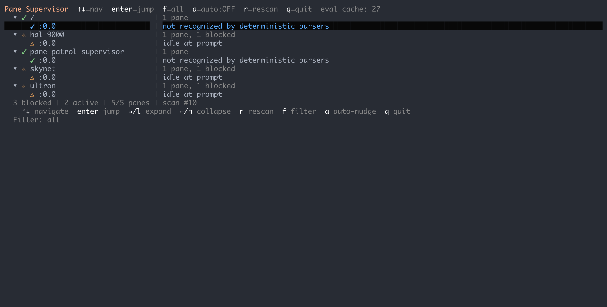
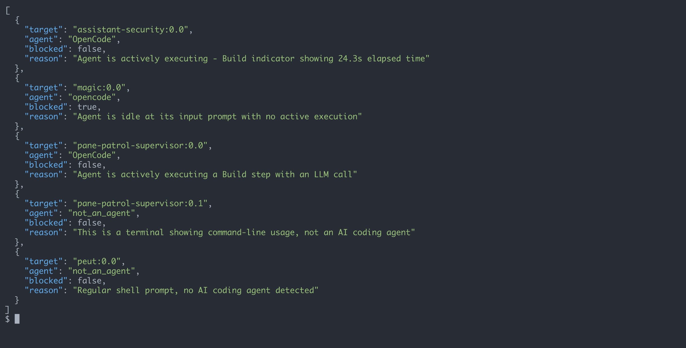

# pane-patrol

ZFC-compliant terminal pane monitor — AI observes AI coding agents for blocked/waiting states.

## What it does

pane-patrol monitors terminal multiplexer panes (tmux) and uses an LLM
to determine if AI coding agents are blocked waiting for human input —
confirmation dialogs, permission prompts, questions, or interactive selections.

Following [ZFC (Zero False Commands)](docs/design-principles.md) principles,
**all judgment calls are made by the LLM**. Go code only provides transport.



## Installation

### Homebrew (macOS / Linux)

```bash
brew install timvw/tap/pane-patrol
```

### Go install

```bash
go install github.com/timvw/pane-patrol@latest
```

### From source

```bash
git clone https://github.com/timvw/pane-patrol.git
cd pane-patrol
go build -o bin/pane-patrol .
```

## Supervisor TUI

The primary way to use pane-patrol. Launch an interactive terminal UI that
continuously scans all panes, shows agent status, and lets you unblock stuck
agents with LLM-suggested actions or free-form text.

```bash
pane-patrol supervisor
```

### Keyboard shortcuts

| Key | Action |
|-----|--------|
| `Enter` / click | Jump to pane in tmux |
| `->` / `Tab` | Focus action panel |
| `<-` / `Esc` | Back to pane list |
| `1`-`9` | Execute Nth action directly |
| `t` | Type free-form text to send to pane |
| `f` | Cycle display filter: blocked / agents / all |
| `a` | Toggle auto-nudge |
| `r` | Force rescan |
| `q` | Quit |

### Display filter

Press `f` to cycle through three views:

- **blocked** (default) — only agent panes that are stuck waiting for input
- **agents** — all agent panes (blocked + active), hides non-agents
- **all** — everything including non-agent panes

The summary line shows `visible/total panes` so you can see how much is filtered.

| blocked | agents | all |
|---------|--------|-----|
|  |  |  |

### Auto-nudge

Press `a` to toggle automatic nudging. When enabled, the supervisor
automatically sends the LLM-recommended action to blocked panes if the
action's risk level is within the configured threshold (default: `low`).

### Two-panel layout

- **Left panel**: session/pane list grouped by tmux session, with status icons
  (`⚠` blocked, `✓` active, `·` non-agent)
- **Right panel**: details and LLM-suggested actions for the selected pane,
  with risk levels (`low`, `med`, `HIGH`)

## Configuration

pane-patrol loads configuration with this precedence (highest to lowest):

1. CLI flags
2. Environment variables (`PANE_PATROL_*`)
3. Config file
4. Built-in defaults

### Config file

pane-patrol searches for a config file in this order:

1. `.pane-patrol.yaml` in the current directory
2. `~/.config/pane-patrol/config.yaml`

Example `.pane-patrol.yaml`:

```yaml
provider: openai
model: gpt-4o-mini

# Sessions to exclude from scanning entirely (saves LLM tokens)
exclude_sessions:
  - langfuse
  - tmux-resume

# Auto-refresh interval (set to "0" or "off" to disable)
refresh: 30s

# Auto-nudge settings
auto_nudge: false
auto_nudge_max_risk: low  # low, medium, or high

# OTEL/Langfuse observability
otel_endpoint: http://localhost:3000/api/public/otel
otel_headers: "Authorization=Basic <base64-encoded-credentials>"
```

### Environment variables

| Variable | Description |
|----------|-------------|
| `PANE_PATROL_PROVIDER` | LLM provider: `anthropic` or `openai` |
| `PANE_PATROL_MODEL` | Model name |
| `PANE_PATROL_BASE_URL` | Override LLM API endpoint |
| `PANE_PATROL_API_KEY` | Override LLM API key |
| `PANE_PATROL_FILTER` | Regex filter on session names (include) |
| `PANE_PATROL_EXCLUDE_SESSIONS` | Comma-separated session names to exclude |
| `PANE_PATROL_REFRESH` | Auto-refresh interval (e.g. `30s`, `0` to disable) |
| `PANE_PATROL_CACHE_TTL` | Verdict cache TTL (e.g. `5m`, `0` to disable) |
| `PANE_PATROL_AUTO_NUDGE` | Enable auto-nudge (`true` or `1`) |
| `PANE_PATROL_AUTO_NUDGE_MAX_RISK` | Max risk for auto-nudge: `low`, `medium`, `high` |
| `ANTHROPIC_API_KEY` | Fallback API key for Anthropic |
| `OPENAI_API_KEY` | Fallback API key for OpenAI |
| `AZURE_OPENAI_API_KEY` | Fallback API key for Azure |
| `AZURE_RESOURCE_NAME` | Azure resource name (auto-builds base URL) |
| `OTEL_EXPORTER_OTLP_ENDPOINT` | OTEL exporter endpoint |
| `OTEL_EXPORTER_OTLP_HEADERS` | OTEL exporter headers |

## CLI commands

### List all panes

```bash
pane-patrol list
pane-patrol list --filter "^wt-"
```

### Capture pane content

```bash
pane-patrol capture mysession:0.0
```

### Check a single pane

```bash
pane-patrol check mysession:0.0
```

Output includes agent classification, blocked status, reason, LLM-suggested
actions with risk levels, and token usage.

### Scan all panes



```bash
# Scan all panes (parallel by default, max 10 concurrent)
pane-patrol scan

# Scan with filter and custom parallelism
pane-patrol scan --filter "^wt-" --parallel 4

# Include raw pane content in output
pane-patrol scan --verbose

# Pipe through jq to find blocked agents
pane-patrol scan | jq '[.[] | select(.blocked == true)]'
```

## Observability

pane-patrol supports OTEL tracing with Langfuse integration. Configure
`otel_endpoint` and `otel_headers` in the config file or via environment
variables. Each scan creates a trace with per-pane spans including:

- Pane target, session, and command
- Process tree (shell PID + child processes)
- LLM verdict (agent type, blocked status, reason)
- Token usage (input/output)
- Cache hit/miss status

## Supported models

pane-patrol works with any model accessible via the Anthropic Messages API or
OpenAI Chat Completions API.

### Anthropic (provider: `anthropic`)

| Model | Status | Notes |
|-------|--------|-------|
| `claude-sonnet-4-5` | Supported (default) | Good balance of speed and accuracy |
| `claude-opus-4-5` | Supported | Higher quality, slower |

### OpenAI (provider: `openai`)

| Model | Status | Notes |
|-------|--------|-------|
| `gpt-4o-mini` | Supported | Fast and cheap |
| `gpt4o` | Supported | Azure deployment name has no hyphen |
| `gpt-5` | Supported | Reasoning model |
| `gpt-5.1` | Supported | Reasoning model |

## Design

See [docs/design-principles.md](docs/design-principles.md) for the full design
philosophy, including ZFC compliance, composability, and feedback loop design.

## License

MIT
